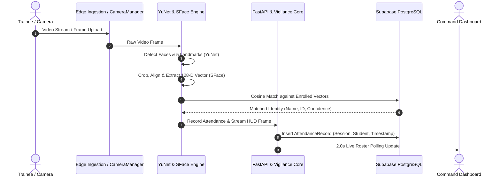

# Software Requirements Specification (SRS)
## Project: DRISHTI — Ministry AI Vision Vigilance & Face Attendance Core
**Document Version:** 2.0  
**Date:** October 2026  
**Target Domain:** Ministry of Skill Development & Entrepreneurship (MSDE), PMKVY & DDU-GKY Training Centres  
**Compliance Standard:** IEEE 830 / DPDP Act 2023 Aligned  

---

## 📑 Table of Contents
1. [Introduction](#1-introduction)
   - 1.1 Purpose
   - 1.2 Scope of System
   - 1.3 Definitions, Acronyms & Abbreviations
   - 1.4 References
2. [Overall Description](#2-overall-description)
   - 2.1 Product Perspective & Multi-Tier Architecture
   - 2.2 User Personas & Characteristics
   - 2.3 Operating Environment
   - 2.4 Design & Implementation Constraints
   - 2.5 Assumptions & Dependencies
3. [System Architecture & Dataflow](#3-system-architecture--dataflow)
4. [Functional Requirements (FR)](#4-functional-requirements-fr)
   - FR-1: Real-Time AI Face Detection & Recognition
   - FR-2: Student Facial Biometric Enrollment
   - FR-3: Multi-Source Video & Camera Ingestion
   - FR-4: Continuous Presence & Dwell Curve Accumulation
   - FR-5: Privacy-Preserving Face Obfuscation (DPDP 2023)
   - FR-6: Feed Integrity & Anti-Tamper Watchdog
   - FR-7: Sanctioned BOM Equipment Utilization Assessor
   - FR-8: Cryptographic SHA-256 Hash-Chained Alert Ledger
   - FR-9: Skilling Integrity Score (SIS) Engine
   - FR-10: Risk-Weighted Physical Audit Dispatch Queue
   - FR-11: Adversarial Red-Team Simulator
   - FR-12: Cloud Supabase Synchronization & Offline Store-and-Forward
5. [External Interface Requirements](#5-external-interface-requirements)
   - 5.1 User Interfaces (UI/UX)
   - 5.2 Hardware & Camera Interfaces
   - 5.3 Software & Cloud Interfaces
   - 5.4 Communication & Streaming Protocols
6. [Non-Functional Requirements (NFR)](#6-non-functional-requirements-nfr)
   - 6.1 Performance & Latency (NFR-1)
   - 6.2 Security, Cryptography & Privacy (NFR-2)
   - 6.3 Reliability & Fault Tolerance (NFR-3)
   - 6.4 Scalability & Portability (NFR-4)
   - 6.5 Usability & Accessibility (NFR-5)
7. [Database Schema & Data Model](#7-database-schema--data-model)
8. [Verification, Validation & Acceptance Criteria](#8-verification-validation--acceptance-criteria)

---

## 1. Introduction

### 1.1 Purpose
This document specifies the software, architectural, and operational requirements for **Drishti**, an automated, AI-powered computer vision vigilance and facial attendance platform. Drishti is engineered to eliminate systemic ghost attendance, biometric "punch-and-leave" fraud, instructor absenteeism, and equipment misrepresentation in government-sanctioned skilling programs (e.g., PMKVY, DDU-GKY).

### 1.2 Scope of System
Drishti operates across three integrated operational tiers:
1. **Tier 1 (Edge Node)**: Processes local CCTV/camera streams in real time, applies DPDP-compliant privacy face blurring, accumulates dwell time curves, and monitors feed integrity.
2. **Tier 2 (AI Vision & Attendance Pipeline)**: Uses ONNX-based neural networks (YuNet for landmark localization and SFace for 128-dimensional embedding matching) to identify enrolled trainees and log attendance.
3. **Tier 3 (Cloud Command & Vigilance Core)**: Cross-references reported biometric punches against physical visual presence, computes dynamic Skilling Integrity Scores (SIS), maintains an immutable SHA-256 hash-chained alert ledger, and syncs with cloud PostgreSQL (Supabase).

### 1.3 Definitions, Acronyms & Abbreviations
- **AEBAS**: Aadhaar-Enabled Biometric Attendance System
- **BOM**: Bill of Materials (Sanctioned training machinery & equipment list)
- **DPDP Act 2023**: Digital Personal Data Protection Act of India (2023)
- **Dwell Curve**: Time-series curve tracking sustained physical headcount over an entire classroom session.
- **MJPEG**: Motion JPEG video streaming protocol (`multipart/x-mixed-replace`)
- **ONNX**: Open Neural Network Exchange format for optimized cross-platform inference
- **Punch-and-Leave**: Biometric forgery where candidates register their biometric punch and depart immediately.
- **SFace**: Deep neural network for face feature embedding extraction (128-D vector)
- **SIS**: Skilling Integrity Score (0–100 compliance metric computed per centre)
- **YuNet**: High-speed, lightweight convolutional neural network for face and 5-landmark detection

### 1.4 References
- IEEE Standard 830-1998: Recommended Practice for Software Requirements Specifications.
- Digital Personal Data Protection Act (India), Act No. 22 of 2023.
- OpenCV Zoo Model Specifications: `face_detection_yunet_2023mar.onnx` & `face_recognition_sface_2021dec.onnx`.

---

## 2. Overall Description

### 2.1 Product Perspective & Multi-Tier Architecture
Drishti replaces manual, spot-check inspections with an autonomous, real-time AI compliance layer that connects edge sensors directly to state and national monitoring command centres.

```
┌────────────────────────────────────────────────────────────────────────┐
│                        TIER 1: EDGE LAYER (L1)                         │
│  - Multi-source Ingestion (Webcam, RTSP, MP4)                          │
│  - DPDP 2023 Face Blurring / Anonymous Headcount (YOLOv8)              │
│  - Dwell Accumulation & BOM Equipment Interaction Assessor             │
│  - 72-Hour Offline SQLite Store-and-Forward Buffer                     │
└──────────────────────────────────┬─────────────────────────────────────┘
                                   │ (Cryptographically Signed Telemetry)
┌──────────────────────────────────▼─────────────────────────────────────┐
│                   TIER 2: AI VISION & ATTENDANCE CORE                  │
│  - YuNet 5-Landmark Facial Alignment & Cropping                        │
│  - SFace 128-D Embedding Generator & Cosine Matcher (Threshold: 0.45)  │
│  - Live MJPEG Stream Annotator (HUD Bounding Boxes & Confidence)       │
└──────────────────────────────────┬─────────────────────────────────────┘
                                   │ (REST API & Real-Time Sync)
┌──────────────────────────────────▼─────────────────────────────────────┐
│                 TIER 3: CLOUD COMMAND & VIGILANCE (L3)                 │
│  - Supabase PostgreSQL (Vector Embeddings & Attendance Records)         │
│  - SHA-256 Hash-Chained Immutable Alert Ledger                         │
│  - SIS Risk-Scoring Engine & Audit Dispatch Queue                      │
│  - Bilingual Responsive Web Dashboard (English / Hindi)                │
└────────────────────────────────────────────────────────────────────────┘
```

### 2.2 User Personas & Characteristics
1. **National Monitoring Officer (MSDE)**: Analyzes macro rankings, nationwide compliance anomalies, and systemic dwell trends across states.
2. **State Vigilance Inspector**: Receives priority alerts from the automated Risk-Weighted Audit Dispatch Queue and executes ground inspections.
3. **Training Centre Compliance Officer**: Enrolls candidates, connects local camera feeds, and monitors live room attendance rosters.

### 2.3 Operating Environment
- **Server Runtime**: Python 3.11+, Linux / Windows / macOS / Docker Container.
- **Client Runtime**: Modern web browsers (Chrome, Edge, Firefox, Safari) on Desktop & Mobile.
- **Hardware Acceleration**: CPU-optimized (ONNX Runtime / OpenCV DNN backend), optional CUDA / OpenVINO acceleration.

---

## 3. System Architecture & Dataflow



---

## 4. Functional Requirements (FR)

### FR-1: Real-Time AI Face Detection & Recognition
- **Description**: The system shall process incoming video frames, detect all human faces with confidence $\ge 0.60$, extract 5 facial landmarks, and compute a 128-dimensional L2-normalized feature vector.
- **Inputs**: Video frame (BGR numpy array, min 480p).
- **Outputs**: Bounding boxes $[x, y, w, h]$, landmarks $[x_1, y_1, \dots, x_5, y_5]$, confidence score, matched `student_id`, and cosine distance.
- **Verification Rule**: Two embeddings $E_1, E_2$ shall be verified as the same individual if $\text{Cosine Distance}(E_1, E_2) \le 0.45$.

### FR-2: Student Facial Biometric Enrollment
- **Description**: The system shall allow authorized officers to enroll a new trainee by providing `student_id`, `name`, `batch`, and 1 to 3 distinct facial reference images.
- **Processing**: The system shall detect faces across all submitted reference images, extract 128-D vectors, compute the mean vector, normalize it ($\|V\| = 1$), and persist it to database.

### FR-3: Multi-Source Video & Camera Ingestion
- **Description**: The system shall support four concurrent ingestion modes without blocking the main event loop:
  1. **Browser Webcam**: Client-side canvas capture via WebRTC (`getUserMedia`).
  2. **USB Webcam**: Direct hardware capture (`cv2.VideoCapture(0)`).
  3. **RTSP Stream**: Remote CCTV / IP camera network stream (`rtsp://...`).
  4. **Video File**: Local MP4/AVI file playback and simulation loops.

### FR-4: Continuous Presence & Dwell Curve Accumulation
- **Description**: The system shall track the instantaneous headcount at 5-minute sampling intervals across a training session, generating a continuous dwell profile.
- **Anomaly Detection**: If the sustained headcount drops by $\ge 40\%$ within the first 30 minutes while the reported register count remains high, the system shall flag a **`PUNCH_AND_LEAVE_SUSPECTED`** critical alert.

### FR-5: Privacy-Preserving Face Obfuscation (DPDP 2023)
- **Description**: For general vigilance feeds where biometric identity is not required, the edge module shall apply an irreversible Gaussian blur ($\text{kernel} \ge 51\times 51, \sigma=30$) to all facial regions prior to downstream transmission or public viewing.

### FR-6: Feed Integrity & Anti-Tamper Watchdog
- **Description**: The edge watchdog shall evaluate every frame for visual feed anomalies:
  - **Blackout Detection**: Mean luminance $< 10.0$ and variance $< 5.0$.
  - **Frozen / Loop Feed**: SSIM (Structural Similarity Index) $= 1.000$ across 30 consecutive samples.
  - **Lens Occlusion**: Sudden loss of edge gradients and contrast.
- **Action**: Immediately append a cryptographic alert to the ledger and penalize the centre's SIS rating.

### FR-7: Sanctioned BOM Equipment Utilization Assessor
- **Description**: The system shall verify physical trainee interaction with sanctioned training machinery (e.g., Computer PCs, Sewing Machines, Solar PV Rigs) as defined in the centre's Bill of Materials (BOM).
- **Metric**: Flag items as `IDLE` if spatial human-machine interaction duration $< 30\%$ of scheduled practical time.

### FR-8: Cryptographic SHA-256 Hash-Chained Alert Ledger
- **Description**: Every compliance alert generated across the network shall be encapsulated in a tamper-evident block containing:
  $$\text{Block Hash} = \text{SHA256}(\text{Index} + \text{Timestamp} + \text{Centre ID} + \text{Alert Type} + \text{Prev Hash} + \text{Payload})$$
- **Verification**: The system shall provide an audit API endpoint (`/api/ledger/verify`) that validates the hash chain from the Genesis block to the tip, flagging any post-hoc database tampering.

### FR-9: Skilling Integrity Score (SIS) Engine
- **Description**: The cloud core shall compute a composite score (0 to 100) for every training centre based on:
  $$\text{SIS} = 100 - (\text{Penalty}_{\text{Attendance}} + \text{Penalty}_{\text{Feed}} + \text{Penalty}_{\text{Equipment}} + \text{Penalty}_{\text{Trainer}} + \text{Penalty}_{\text{Collusion}})$$
- **Risk Categorization**:
  - **$\text{SIS} \ge 85$**: Compliant (Green)
  - **$65 \le \text{SIS} < 85$**: Moderate Risk (Amber)
  - **$\text{SIS} < 65$**: High Risk / Audit Priority (Red)

### FR-10: Risk-Weighted Physical Audit Dispatch Queue
- **Description**: Training centres flagged with High Risk ($\text{SIS} < 65$) or Critical Feed Tampering shall be automatically enqueued into the State Vigilance Inspector's priority dispatch roster with one-click dispatch actioning.

### FR-11: Adversarial Red-Team Simulator
- **Description**: The dashboard shall include an integrated red-team benchmark console allowing administrators to simulate six standard attack vectors (R1: Lens Occlusion, R2: Video Loop Replay, R3: Punch-and-Leave, R4: Idle Equipment Prop, R5: Absent Instructor, R6: Silence-as-Alarm) to verify automated system defense.

### FR-12: Cloud Supabase Synchronization & Offline Store-and-Forward
- **Description**: In normal connectivity, data synchronizes with cloud Supabase PostgreSQL. In rural/intermittent connectivity conditions, the edge node shall buffer encrypted telemetry in a local SQLite queue and resync automatically upon link restoration.

---

## 5. External Interface Requirements

### 5.1 User Interfaces (UI/UX)
- **Responsive Web Dashboard**: Fluid multi-card vigilance dashboard adapting seamlessly from 4K desktop command displays down to 360px mobile viewports.
- **Mobile Navigation**: Collapsible slide-out drawer navigation triggered by a topbar hamburger menu (☰).
- **HUD Video Stream**: Live video element displaying dynamic bounding boxes, confidence badges, facial landmark dots, and connection status pills.
- **Bilingual Switch**: Instant client-side English $\leftrightarrow$ Hindi translation toggle.

### 5.2 Hardware & Camera Interfaces
- Direct integration with UVC-compliant USB Webcams, Laptop Integrated Webcams, RTSP H.264/H.265 IP CCTV cameras, and mobile camera streams.

### 5.3 Software & Cloud Interfaces
- **Database**: PostgreSQL 15+ hosted on Supabase (accessed via connection pooler on port `6543`/`5432`).
- **REST API**: FastAPI ASGI application conforming to OpenAPI 3.0 standards.

### 5.4 Communication & Streaming Protocols
- **MJPEG over HTTP**: `Content-Type: multipart/x-mixed-replace; boundary=frame`
- **Polling Loop**: Asynchronous HTTP `GET /api/attendance/status` every 2000 ms.

---

## 6. Non-Functional Requirements (NFR)

| ID | Category | Requirement Specification |
| :--- | :--- | :--- |
| **NFR-1** | **Latency & Speed** | Face detection + landmark alignment + 128-D vector matching shall execute in $\le 45\text{ ms}$ per frame on standard CPU hardware. |
| **NFR-2** | **Availability & Uptime** | The cloud vigilance server shall maintain $\ge 99.9\%$ availability supported by automated 24/7 uptime monitoring. |
| **NFR-3** | **Security & Privacy** | Biometric templates shall be stored strictly as irreversible mathematical vector arrays. No raw face imagery shall be stored without explicit officer enrollment authorization. |
| **NFR-4** | **Data Integrity** | SHA-256 hash chains shall detect $100\%$ of single-bit modifications or record deletions in the alert ledger. |
| **NFR-5** | **Scalability** | Connection pooling (`pool_size=10, max_overflow=20`) shall support concurrent polling across multiple training centres simultaneously. |

---

## 7. Database Schema & Data Model

```
                    ┌─────────────────────────┐
                    │        students         │
                    ├─────────────────────────┤
                    │ PK student_id (VARCHAR) │◄────────┐
                    │    name (VARCHAR)       │         │
                    │    batch (VARCHAR)      │         │
                    │    created_at (DATETIME)│         │
                    └────────────┬────────────┘         │
                                 │ 1:N                  │ 1:N
                                 ▼                      │
                    ┌─────────────────────────┐         │
                    │     face_embeddings     │         │
                    ├─────────────────────────┤         │
                    │ PK id (INTEGER)         │         │
                    │ FK student_id (VARCHAR) │         │
                    │    embedding_json (TEXT)│         │
                    │    created_at (DATETIME)│         │
                    └─────────────────────────┘         │
                                                        │
┌─────────────────────────────┐                         │
│     attendance_sessions     │                         │
├─────────────────────────────┤                         │
│ PK session_id (VARCHAR)     │◄────────┐               │
│    classroom (VARCHAR)      │         │ 1:N           │
│    start_time (DATETIME)    │         │               │
│    end_time (DATETIME)      │         │               │
└─────────────────────────────┘         │               │
                                        ▼               │
                          ┌───────────────────────────┐ │
                          │    attendance_records     │ │
                          ├───────────────────────────┤ │
                          │ PK id (INTEGER)           │ │
                          │ FK session_id (VARCHAR)   │─┘
                          │ FK student_id (VARCHAR)   │───┘
                          │    timestamp (DATETIME)   │
                          │    status (VARCHAR)       │
                          └───────────────────────────┘
```

---

## 8. Verification, Validation & Acceptance Criteria

| Requirement | Test Scenario | Acceptance Criteria |
| :--- | :--- | :--- |
| **Face Recognition (FR-1)** | Present enrolled trainee face at diverse angles under standard lighting. | Correct identification with confidence $\ge 85\%$ within 2 frames. |
| **Biometric Enrollment (FR-2)** | Upload 3 facial reference photos through web dashboard. | 128-D vector saved to Supabase; trainee instantly recognized in live feed. |
| **Punch-and-Leave Defense (FR-4)** | Simulate candidate register punch followed by departure (Red-Team R3). | SIS penalized; critical alert appended to SHA-256 ledger. |
| **Ledger Audit (FR-8)** | Trigger `/api/ledger/verify` via UI audit button. | Cryptographic verification returns `is_valid: True` across 100% blocks. |
| **Mobile Responsiveness** | View dashboard on smartphone viewport (360px–450px). | Layout stacks into single column; hamburger drawer functions smoothly without overflow. |
